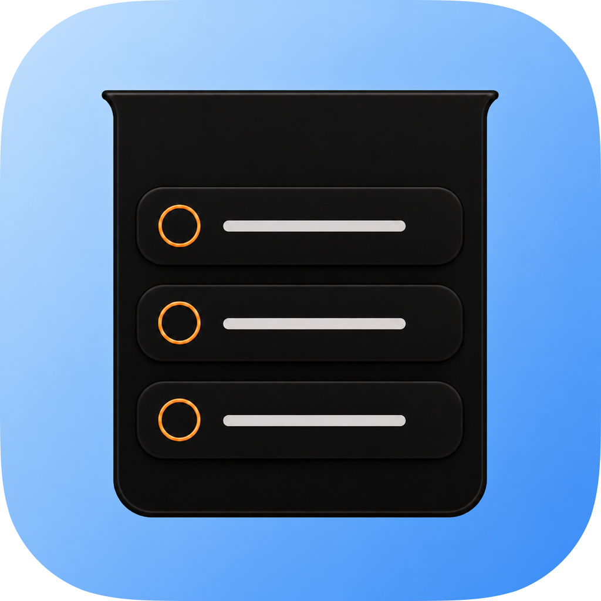
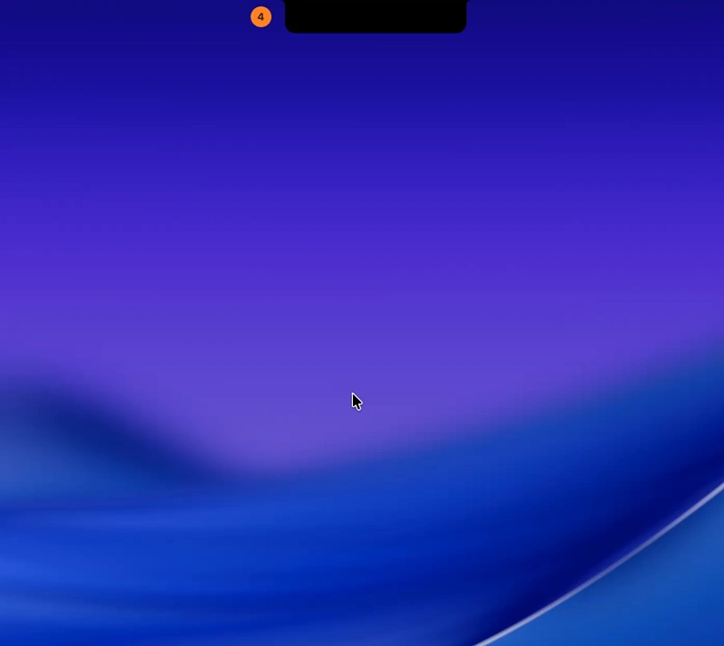

# NotchDo

[](https://github.com/lkuczborski/NotchDo/releases/latest)


[](LICENSE)

<p align="center">
  
</p>

NotchDo is a focused Apple Reminders client that expands from the MacBook
display notch. It keeps the everyday task loop—capture, review, edit, complete—
available without opening a conventional window.

NotchDo uses Apple Reminders directly through EventKit. It has no account,
cloud service, analytics pipeline, or separate task database.

<p align="center">
  
</p>

## Highlights

- Native notch-aware panel that follows the active display and works across
  Spaces
- Immediate hover expansion with a compositor-friendly, continuously rounded
  transition
- List-colored open-task indicator that transitions into the expanded header
- Apple Reminders list selection, list creation, and automatic external-change
  refresh
- Keyboard-ready bottom composer with Return and submit-button actions
- Create, complete, and swipe-to-delete interactions
- New reminders scroll into view after EventKit saves them
- Inline editing for title, notes, due date and time, all-day state, priority,
  and supported recurrence rules
- Escape and outside clicks collapse the active editor; scrolling leaves it open
- Purpose-built permission, loading, empty, and error states

## Requirements

- macOS 14 Sonoma or later
- A Mac with a display notch for the intended experience
- Xcode with Swift 6.2 or later to build from source
- Full Reminders access

## Build and run

The repository is a native Swift Package Manager project. Its project-local
runner builds, bundles, ad-hoc signs, and launches the application:

```sh
./script/build_and_run.sh
```

Available modes:

| Command | Purpose |
| --- | --- |
| `./script/build_and_run.sh` | Build and launch the release configuration |
| `./script/build_and_run.sh --verify` | Launch and confirm the process is running |
| `./script/build_and_run.sh --debug` | Build the debug configuration and open LLDB |
| `./script/build_and_run.sh --logs` | Launch and stream application logs |
| `./script/build_and_run.sh --telemetry` | Stream logs for the NotchDo subsystem |

The Codex Run action is configured through
`.codex/environments/environment.toml` and invokes the same script.

Build output is staged at `dist/NotchDo.app`. Both `dist/` and SwiftPM build
artifacts are intentionally excluded from version control.

## Reminders access

On first use, NotchDo explains why access is needed before requesting full
Reminders permission. macOS retains the decision for subsequent launches.

If permission was denied previously, open:

**System Settings → Privacy & Security → Reminders**

The development bundle uses a stable identifier and designated signing
requirement so repeated local builds are recognized as the same application.

## Data and privacy

Reminder content is read from and written to EventKit in place. NotchDo does
not copy tasks into another persistence layer and does not transmit reminder
data to a server.

Existing `EKReminder` instances are updated instead of being reconstructed.
This preserves fields that NotchDo does not currently expose for editing.

## Current limitations

- EventKit does not expose Apple Reminders' manual sort-position metadata.
  NotchDo therefore preserves the order returned by EventKit and does not offer
  a reorder interaction that it cannot sync back to Reminders.
- Features unavailable through the public EventKit API remain owned by Apple
  Reminders and cannot be edited independently in NotchDo.
- The development runner uses ad-hoc signing; published builds require the
  maintainer's separate distribution workflow.

## Project layout

```text
Sources/NotchDo/
├── App/        Application entry point
├── Models/     Reminder editing and authorization state
├── Stores/     EventKit-backed reminder state
├── Support/    Formatting, layout, and interaction helpers
├── Views/      SwiftUI surfaces and controls
└── Windowing/  AppKit panel integration

Support/        Bundle metadata and sandbox entitlements
script/         Development and distribution workflows
```

## License

NotchDo is available under the [MIT License](LICENSE).

## Acknowledgements

NotchDo's animatable notch silhouette adapts the path geometry from
[DynamicNotchKit](https://github.com/MrKai77/DynamicNotchKit) by Kai Azim,
used under the MIT License. NotchDo adds radius validation and integrates the
shape into its own layout and animation system. The complete upstream
copyright and license text is included in
[Third-Party Notices](THIRD_PARTY_NOTICES.md).
