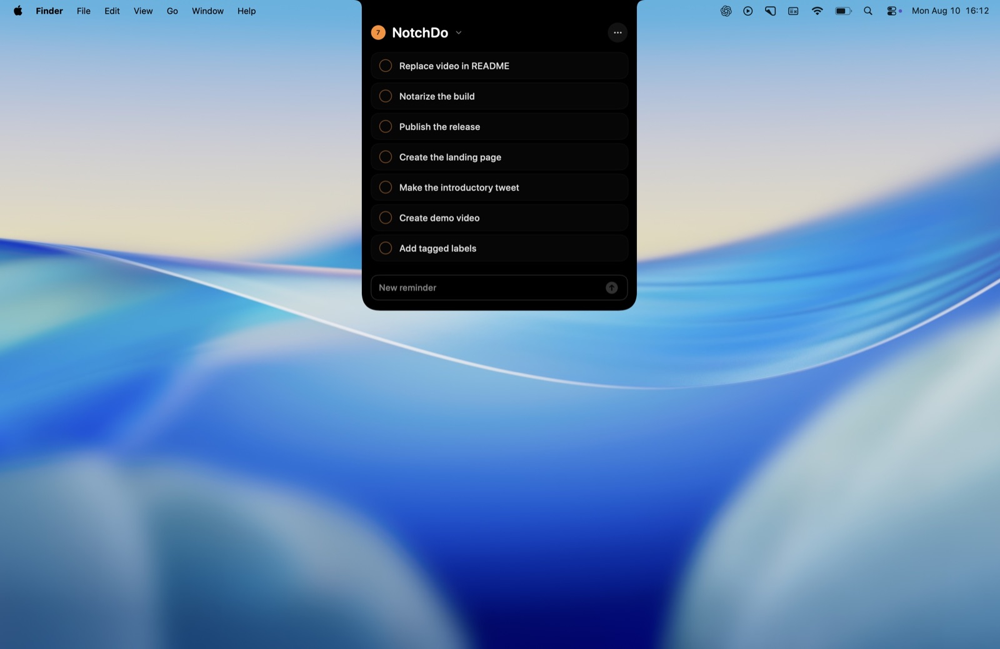

# NotchDo

[](https://github.com/lkuczborski/NotchDo/releases/latest)


[](LICENSE)

<p align="center">
  
</p>

NotchDo is a focused Apple Reminders client that expands from the MacBook
display notch. It keeps the everyday task loop—capture, review, edit, complete—
available without opening a conventional window.

NotchDo uses Apple Reminders directly through EventKit. It has no account,
cloud service, analytics pipeline, or separate task database.

<p align="center">
  
</p>

## Highlights

- A native, notch-aware panel with fluid hover expansion, keyboard input,
  and a list-colored open-task indicator
- **Global Quick Capture:** press **Control–Option–R** from any app to open
  a translucent, Spotlight-style reminder panel; customize the shortcut in Settings
- **Capture with context:** add a title, notes, destination list, and due date;
  use Today, Tomorrow, Next Week, or the date picker
- **Smart scopes:** review Today, Overdue, Scheduled, and All Open across your
  Reminders lists, then edit each reminder in its original list
- **Instant search:** press **Command–F** to filter loaded reminder titles in
  the current list or smart scope; matching ignores case and accents
- Create lists, add reminders, complete with a brief Undo action, and swipe to delete
- Edit title, notes, due date and time, all-day state, priority, and supported
  recurrence rules inline
- Clear permission, first-list, loading, empty, and read-only states, with
  operation-specific errors when a change cannot be saved
- Automatic refresh after external Reminders changes and native Launch at Login

## Install

Download the universal ZIP from [Releases](https://github.com/lkuczborski/NotchDo/releases/latest),
unzip it, and move **NotchDo.app** to **Applications**. Open NotchDo and allow
full Reminders access when prompted. The app lives at the notch rather than
in the Dock.

## Everyday use

**Capture from anywhere.** Press **Control–Option–R** to open Quick Capture.
Type a title, add optional notes, choose a writable list, and set a date.
Press Return or use the submit button to save. Escape dismisses the panel.
Open NotchDo Settings to record your preferred global shortcut; if another
app already owns it, NotchDo reports the conflict and retains the previous shortcut.

**Work from the notch.** Move the pointer to the notch to expand your list.
Start typing in the bottom composer to add a reminder to the selected list.
Click a reminder to edit its details. Escape or an outside click closes the
active editor; scrolling keeps it open. Complete a reminder with its check
control and use Undo to restore the most recent completion. Repeating reminders
ask for confirmation before deletion.

**Choose a list or a smart scope.** Use the header picker to switch between
lists, create a list, or open Today, Overdue, Scheduled, or All Open. Smart
scopes gather matching incomplete reminders across lists. The bottom composer
is hidden there because there is no single destination; use Quick Capture
and choose a list to add a reminder. Read-only lists remain browsable, with
changes disabled.

**Find a reminder.** Press **Command–F** or use the search button. Results
update as you type without changing EventKit's order. Search matches titles:
for example, `cafe` also finds `café`. Use the single close-search button or
Escape to return to the unfiltered view. Search covers the current loaded
list or smart scope, not completed reminders or notes.

**Start fresh.** If there are no lists, use Create List to make your first
one. An empty writable list offers the composer immediately. Empty smart
scopes explain that there are no matching reminders.

<p align="center">
  
</p>

## Requirements

- macOS 14 Sonoma or later
- A Mac with a display notch for the intended experience
- Xcode with Swift 6.2 or later to build from source
- Full Reminders access

## Build and run

The repository is a native Swift Package Manager project. Its project-local
runner builds, bundles, ad-hoc signs, and launches the application:

```sh
./script/build_and_run.sh
```

Available modes:

| Command | Purpose |
| --- | --- |
| `./script/build_and_run.sh` | Build and launch the release configuration |
| `./script/build_and_run.sh --verify` | Launch and confirm the process is running |
| `./script/build_and_run.sh --debug` | Build the debug configuration and open LLDB |
| `./script/build_and_run.sh --logs` | Launch and stream application logs |
| `./script/build_and_run.sh --telemetry` | Stream logs for the NotchDo subsystem |

Build output is staged at `dist/NotchDo.app`. Both `dist/` and SwiftPM build
artifacts are intentionally excluded from version control.

## Reminders access

On first use, NotchDo explains why access is needed before requesting full
Reminders permission. macOS retains the decision for subsequent launches.

If permission was denied previously, open:

**System Settings → Privacy & Security → Reminders**

## Data and privacy

Reminder content is read from and written to EventKit in place. NotchDo does
not copy tasks into another persistence layer and does not transmit reminder
data to a server.

Existing `EKReminder` instances are updated instead of being reconstructed.
This preserves fields that NotchDo does not currently expose for editing.

## Current limitations

- EventKit does not expose Apple Reminders' manual sort-position metadata.
  NotchDo therefore preserves the order returned by EventKit and does not offer
  a reorder interaction that it cannot sync back to Reminders.
- Features unavailable through the public EventKit API remain owned by Apple
  Reminders and cannot be edited independently in NotchDo.

## Project layout

```text
Sources/NotchDo/
├── App/        Application entry point
├── Models/     Reminder editing and authorization state
├── Stores/     EventKit-backed reminder state
├── Support/    Formatting, layout, and interaction helpers
├── Views/      SwiftUI surfaces and controls
└── Windowing/  AppKit panel integration

Support/        Bundle metadata and sandbox entitlements
script/         Development and distribution workflows
```

## License

NotchDo is available under the [MIT License](LICENSE).

## Acknowledgements

NotchDo's animatable notch silhouette adapts the path geometry from
[DynamicNotchKit](https://github.com/MrKai77/DynamicNotchKit) by Kai Azim,
used under the MIT License. NotchDo adds radius validation and integrates the
shape into its own layout and animation system. The complete upstream
copyright and license text is included in
[Third-Party Notices](THIRD_PARTY_NOTICES.md).
