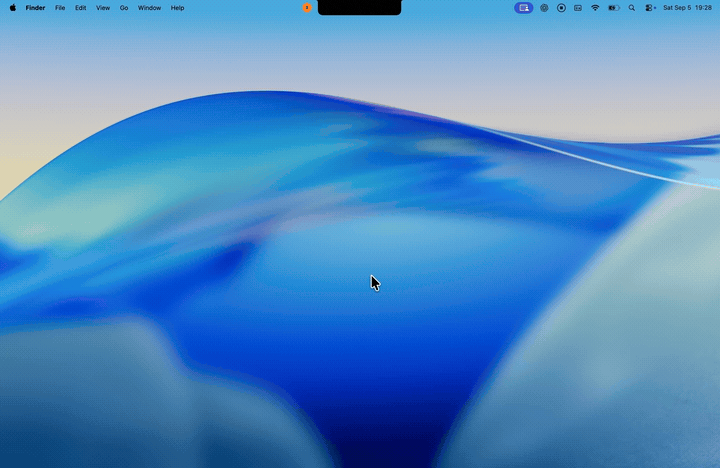

# NotchDo

<p align="center">
  
</p>

NotchDo is a focused Apple Reminders client that expands from the MacBook
display notch. It keeps the everyday task loop—capture, review, edit, complete—
available without opening a conventional window.

NotchDo uses Apple Reminders directly through EventKit. It has no account,
cloud service, analytics pipeline, or separate task database.

<p align="center">
  
</p>

## Highlights

- Native notch-aware panel that follows the active display and works across
  Spaces
- Immediate hover expansion with a compositor-friendly, continuously rounded
  transition
- List-colored open-task indicator that transitions into the expanded header
- Apple Reminders list selection and automatic external-change refresh
- Keyboard-ready bottom composer with Return and submit-button actions
- Create, complete, reorder, and swipe-to-delete interactions
- New reminders append to the bottom and scroll into view
- Inline editing for title, notes, due date and time, all-day state, priority,
  and supported recurrence rules
- Escape, scrolling, and outside clicks collapse the active editor
- Purpose-built permission, loading, empty, and error states

## Requirements

- macOS 14 Sonoma or later
- A Mac with a display notch for the intended experience
- Xcode with Swift 6.2 or later to build from source
- Full Reminders access

## Build and run

The repository is a native Swift Package Manager project. Its project-local
runner builds, bundles, ad-hoc signs, and launches the application:

```sh
./script/build_and_run.sh
```

Available modes:

| Command | Purpose |
| --- | --- |
| `./script/build_and_run.sh` | Build and launch the release configuration |
| `./script/build_and_run.sh --verify` | Launch and confirm the process is running |
| `./script/build_and_run.sh --debug` | Build the debug configuration and open LLDB |
| `./script/build_and_run.sh --logs` | Launch and stream application logs |
| `./script/build_and_run.sh --telemetry` | Stream logs for the NotchDo subsystem |

The Codex Run action is configured through
`.codex/environments/environment.toml` and invokes the same script.

Build output is staged at `dist/NotchDo.app`. Both `dist/` and SwiftPM build
artifacts are intentionally excluded from version control.

## Reminders access

On first use, NotchDo explains why access is needed before requesting full
Reminders permission. macOS retains the decision for subsequent launches.

If permission was denied previously, open:

**System Settings → Privacy & Security → Reminders**

The development bundle uses a stable identifier and designated signing
requirement so repeated local builds are recognized as the same application.

## Data and privacy

Reminder content is read from and written to EventKit in place. NotchDo does
not copy tasks into another persistence layer and does not transmit reminder
data to a server.

Existing `EKReminder` instances are updated instead of being reconstructed.
This preserves fields that NotchDo does not currently expose for editing.

## Current limitations

- EventKit does not expose Apple Reminders' manual sort-position metadata.
  Dragged order is therefore maintained per list for the current NotchDo
  session only. Persisting it would require a separate metadata store.
- Features unavailable through the public EventKit API remain owned by Apple
  Reminders and cannot be edited independently in NotchDo.
- The development runner uses ad-hoc signing. External distribution requires a
  Developer ID certificate, hardened runtime, notarization, and release
  packaging.

## Project layout

```text
Sources/NotchDo/
├── App/        Application entry point
├── Models/     Reminder editing and authorization state
├── Stores/     EventKit-backed reminder state
├── Support/    Formatting, layout, and interaction helpers
├── Views/      SwiftUI surfaces and controls
└── Windowing/  AppKit panel integration

Support/        Bundle metadata and sandbox entitlements
script/         Local build, bundle, sign, and run workflow
```

## Release

The current application version is defined in `Support/Info.plist`. Before a
distribution build, update both `CFBundleShortVersionString` and
`CFBundleVersion`, then complete Developer ID signing and notarization outside
the development runner.
